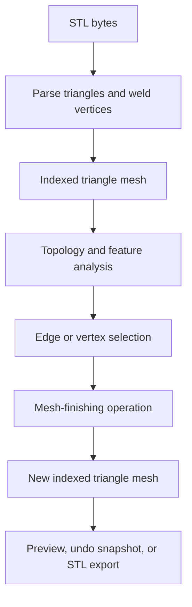

# EdgeCraft

EdgeCraft is a local, single-page STL mesh-finishing workbench. It imports a binary or ASCII STL, reconstructs topology by welding coincident triangle corners, lets the user select real crease edges or mesh vertices, and destructively rebuilds the triangle mesh with chamfer, fillet, Flatillet, or Chamfillet geometry.

The current application is the self-contained [`EdgeCraftv01alpha.html`](https://github.com/techrote/EdgeCraft/blob/main/EdgeCraftv01alpha.html). It contains its UI, styles, Three.js runtime, mesh algorithms, STL import/export, and renderer in one offline-capable file. Meshes remain in the browser.

This document describes the implementation at commit [`009f685`](https://github.com/techrote/EdgeCraft/commit/009f685440936fb6281770b53ef7b296ee251bd7), dated 26 August 2026. It describes only the implemented STL editor; future design-conversion concepts are outside this scope.

## What EdgeCraft is—and is not

EdgeCraft is currently:

- a destructive triangle-mesh editor for STL data;
- a browser application with no server dependency;
- a useful prototype of separable edge- and vertex-finishing algorithms;
- best suited to relatively clean, consistently wound, manifold, mostly convex mechanical meshes.

It is not currently:

- a parametric or feature-history CAD system;
- an exact boundary-representation (B-rep) solid-modeling kernel;
- a general-purpose Boolean or remeshing library;
- guaranteed to preserve materials, UVs, vertex normals, object hierarchy, or stable entity IDs;
- robust for every concave, open, non-manifold, self-intersecting, or densely intersecting selection.

STL coordinates are unitless. The application labels them as millimetres, so the host or user must ensure that the imported numbers actually represent millimetres.

## Basic use

1. Open or drop a binary or ASCII `.stl` file. Import happens locally.
2. Choose **Edges** or **Vertices**.
3. Click a feature to replace the selection, Ctrl/Cmd-click to add, Shift-click to remove, or Alt-click to trace a feature chain.
4. Choose Chamfer, Fillet, Flatillet where available, or Chamfillet.
5. Set the requested size and any operation-specific parameters.
6. Apply the operation, inspect the result, and export binary or ASCII STL.

Navigation uses middle-button drag to pan, Shift + middle-button drag to rotate, and the wheel to zoom. X-ray mode permits selection through the visible surface. Undo and redo keep up to 24 complete in-memory mesh snapshots.

The default selection settings are a 22° minimum feature crease, 38° maximum turn between chain edges, 128-edge chain limit, unlimited chain distance, bidirectional tracing, and no automatic stop at branches.

## Data flow



Every applied operation replaces the mesh. Vertex indices and edge keys may change, so the UI clears the selection and rebuilds topology after each successful operation.

## Mesh representation

The geometry code uses a deliberately small representation:

```js
{
  vertices: Vector3[],       // Three.js Vector3 objects
  faces: [number, number, number][]
}
```

An edge is identified by the sorted string key `"smallerVertexId:largerVertexId"`, such as `"4:7"`. Vertex selections are `Set<number>` values; edge selections are `Set<string>` values.

`buildTopology(vertices, faces)` derives:

| Field | Meaning |
| --- | --- |
| `vertexFaces[v]` | Triangle indices incident to vertex `v` |
| `neighbors[v]` | Unique vertices connected to `v` by triangle edges |
| `edgeFaces[key]` | Triangles incident to the canonical edge key |
| `faceNormals[f]` | Unit normal calculated from triangle winding |

The application layer has a second, near-duplicate topology builder which also calculates the angle between the two incident face normals for every edge. A boundary or non-manifold edge is represented as having a 180° UI angle, but it is not operable: edge finishing requires exactly two incident faces.

### STL import

`parseStl(arrayBuffer, tolerance)` detects binary STL from the 80-byte header and declared triangle count; otherwise it extracts ASCII `vertex` records. Binary files declaring more than 20 million triangles are rejected.

`weldTriangles(triangles, tolerance)` then turns STL's duplicated triangle corners into indexed vertices. It uses spatial hash buckets and merges points whose squared distance is within the configured tolerance. The default tolerance is `0.00001` model units. Degenerate faces can be discarded during import and are discarded by default.

Welding is essential because STL contains triangles, not explicit shared topology. A tolerance that is too small leaves cracks and duplicated edges; one that is too large can merge deliberately separate details.

### Feature edges and chain selection

A selectable edge must:

- belong to exactly two triangles; and
- meet the configured minimum angle between adjacent face normals.

Coplanar STL triangulation diagonals are therefore excluded even though they are present in the triangle index. Alt-click chain tracing follows eligible feature edges, preferring the smallest directional turn. It can trace in both directions, stop at branches, stop after a cumulative length, and stop at an edge-count limit.

Chain detection belongs to the application layer rather than the geometry core. A larger CAD host can use its own entity-selection system and submit explicit vertex IDs or edge endpoint pairs.

## Edge operations

All current edge operations are implemented by `finishEdges(options)`. The function recognises selected collinear triangle edges with the same two support-face normals as one geometric run. This allows a finish to cross coplanar STL subdivisions instead of stopping at every triangle boundary.

Only convex, non-coplanar, two-face manifold edges are accepted. Concave edges, coplanar diagonals, open boundaries, malformed keys, and unsupported cases are skipped. If nothing usable remains, the operation throws an error.

### Edge Chamfer

Edge Chamfer creates one cutting plane for each distinct selected run and clips the closed mesh against it. The chamfer profile normal is interpolated between the two incident face normals.

- **Size** controls how far the cut travels from the original edge in model units.
- **Profile angle** biases the cut toward one incident face. The effective core range is clamped to 5–85°; 45° gives an even profile on a symmetric corner.
- **Curve segments** and **rounding** are not used.

The resulting opening is capped and triangulated. Because a whole geometric run shares one plane, internal coplanar triangle edges do not break or skew the chamfer.

### Edge Fillet

Edge Fillet approximates a circular constant-radius cross-section using tangent planes:

1. Solve for the centre offset from both incident face planes by the requested radius.
2. Spherically interpolate normals between the two faces.
3. Create the requested number of tangent clipping planes.
4. Apply those planes to the mesh in sequence and cap each new boundary.

The requested **size** acts as the profile radius. **Curve segments** controls faceting across the profile without intentionally changing the radius. The chamfer-angle and rounding controls do not apply.

This is a polygonal tangent-plane approximation, not an analytic CAD fillet surface.

### Edge Chamfillet

Edge Chamfillet retains a central chamfer and rounds its shoulders:

1. Construct the central chamfer plane using the selected profile angle.
2. Calculate a shoulder radius from the available chamfer span and the rounding percentage.
3. Add tangent planes between the first face and chamfer plane.
4. Add the central chamfer plane.
5. Add tangent planes between the chamfer plane and second face.
6. Where a selected run terminates against a supported end face, add compatible endpoint-rounding planes.

**Rounding** is a proportion of the available chamfer span, not an independently specified physical radius. Lower values preserve a wider flat; higher values consume more of it. Each shoulder gets `ceil(segments / 2)` intermediate planes, in addition to the central plane and any endpoint planes.

### How edge clipping is rebuilt

`clipClosedMeshByPlane` clips every triangle to a half-space, welds generated intersection points using a scale-relative tolerance, finds single-use edges lying on the cut plane, assembles them into closed loops, and fills each loop with a centroid fan. Unused vertices are removed and all indices are compacted after each plane.

This approach is compact and easy to reason about, but it is global rather than local. If `P` profile planes are generated, the implementation repeatedly processes the current whole mesh and can create substantial intermediate geometry. Its practical cost is roughly proportional to `P × (current vertices + current faces)`, with additional whole-vertex scans used for clamping.

## Vertex operations

All vertex operations are implemented by `finishVertices(options)`. A selected vertex must have a usable convex incident triangle fan. The implementation collects unique support-face normals, orders neighbouring vertices around the corner, rejects non-convex or geometrically ambiguous fans, and cuts a boundary point on every incident edge.

The original triangles around the selected vertex are replaced with polygons that meet this new boundary. The boundary is then filled using the chosen operation.

### Vertex Chamfer

Vertex Chamfer creates a single flat cap:

1. Average the unique incident face normals to obtain a corner direction.
2. Convert the requested size into one cut position on every incident edge.
3. Order the cut points around the vertex and calculate an area-weighted planar centroid.
4. Triangulate the cap as a fan from that centroid.

The result is symmetric with respect to the reconstructed geometric corner rather than the arbitrary diagonals used to triangulate its faces. The edge-mode profile-angle control does not apply to vertices.

### Vertex Flatillet

Flatillet preserves the earlier, flatter radial-cap effect:

- it estimates a safe spherical sag above the cut polygon;
- it creates one point per original boundary vertex in every intermediate ring;
- the rings follow radial meridians from a central apex to the exact boundary;
- the support planes clamp the cap so it cannot grow through the original corner.

Because every ring retains the original boundary's vertex count, the result has visible meridian spokes and tends to look flatter and more polygonally organised than the newer Fillet.

### Vertex Fillet

Vertex Fillet builds a denser compound rounded cap:

1. Estimate a safe apex height from the requested size, cut-boundary radius, and original support planes.
2. Subdivide the boundary approximately in proportion to each boundary edge's length.
3. Build intermediate rings both around and across the cap.
4. Use circular meridian profiles from the apex to each sampled boundary position.
5. Stitch the final dense ring back to the exact, unsmoothed cut polygon.

This reduces the concentration of triangles into a few original spokes and gives a smoother blended result. On an irregular corner it is a heuristic compound cap: local boundary radii vary, so it should not be described as an exact single-radius spherical or rolling-ball CAD fillet.

### Vertex Chamfillet

Vertex Chamfillet creates a raised central flat and a rounded annular shoulder between that flat and the outer cut polygon. The rounding percentage controls both how far the inner flat is inset and how high it can rise. Intermediate rings use a half-cosine parameter so tessellation is concentrated near the two ends of the shoulder, where curvature changes most visibly.

At negligible rounding, or when the support planes leave no safe height, the operation falls back to a flat chamfer cap.

## Shared safety behaviour

### Depth clamping

Depth clamping is enabled by default.

For vertices, each cut is limited to roughly 49% of a neighbouring edge, or 45.5% when both endpoints are selected. This reduces overlap between adjacent replacement patches.

For edges, each profile-plane group is scaled back when the plane would reach another mesh vertex. A very severe reduction is rejected with an instruction to select the full collinear feature chain or use a smaller size.

With clamping disabled, oversized operations throw instead of silently reducing the request. The result report counts clamped and skipped features, but it does not report the final effective size of every local cut.

### Validity checks

The core rejects empty meshes, empty usable selections, non-finite output vertices, degenerate generated triangles, unclosable bevel boundaries, and non-manifold results produced from an initially closed mesh. These checks are useful guards; they are not a complete mesh validator. There is no general self-intersection test, global winding repair, duplicate-face repair, or exact solid classification.

### Output identity

Both finish functions return a newly allocated mesh and do not intentionally mutate the input mesh. They rebuild and compact topology, so callers must treat all previous vertex IDs, edge keys, triangle IDs, selections, and cached topology as invalid after success.

## Current internal structure

Although the repository contains one HTML file, the generated bundle preserves source-section markers:

| Bundled section | Responsibility | Backend relevance |
| --- | --- | --- |
| HTML and CSS | Controls, layout, accessibility, themes | None |
| `three.module.js` revision 170 | Vector math, geometry, rendering | Math is used by the core; most rendering code is not |
| Three.js wide-line helpers | Thick selected/hovered edge overlays | None |
| `standalone/mesh-ops.js` | Topology helpers and all finishing algorithms | This is the core candidate |
| `standalone/edgecraft.js` | Global app state, renderer, selection, history, STL I/O, DOM events | Adapter/UI layer |

The important separation already exists conceptually. `finishVertices`, `finishEdges`, and their helpers have no DOM access and keep their working state local. The I/O and UI functions are more tightly coupled: for example, STL welding reads the **Discard degenerate triangles** checkbox, exporters read controls and global mesh state, and topology is rebuilt a second time for selection and display.

### De facto core functions

These functions exist inside the bundle but are not public exports:

| Function | Purpose |
| --- | --- |
| `edgeKey(a, b)` | Canonical sorted edge identifier |
| `buildTopology(vertices, faces)` | Vertex/face/edge adjacency and face normals |
| `finishVertices(options)` | Apply a vertex finish and return a replacement mesh |
| `profilePlanesForRun(run, options)` | Generate chamfer/fillet tangent planes for an edge run |
| `clipClosedMeshByPlane(...)` | Half-space clip, weld, close, triangulate, and compact |
| `finishEdges(options)` | Group selected runs, prepare planes, clip, and validate |
| `meshEdgeUseCounts(faces)` | Count incident triangles per undirected edge |

Current internal signatures are effectively:

```js
finishVertices({
  vertices,                 // Vector3[]
  faces,                    // [number, number, number][]
  selection,                // Set<number>
  depth,                    // positive model-unit size
  segments = 6,             // clamped to 1..64
  operation,                // chamfer | fillet | flatillet | chamfillet
  rounding = 0.55,          // clamped to 0..1; Chamfillet only
  clampDepth = true
})

finishEdges({
  vertices,
  faces,
  selection,                // Set<"a:b">
  depth,
  angle = 45,               // clamped to 5..85
  segments = 6,             // clamped to 1..64
  operation,                // chamfer | fillet | chamfillet
  rounding = 0.55,
  clampDepth = true
})
```

Both return:

```js
{
  vertices: Vector3[],
  faces: [number, number, number][],
  stats: {
    processed: number,
    skipped: number,
    clampedEdges: number,
    profilePlanes?: number  // edge operations only
  }
}
```

They throw ordinary `Error` instances with human-readable messages. A legacy `blend` input can still infer an operation when `operation` is absent, but new code should not make this compatibility behaviour part of a public contract.

## Backend-module assessment

### Short answer

The geometry code can become a useful triangle-mesh backend module with a small structural refactor. It is already substantially more modular than the single-file distribution suggests. It should not yet be presented as a general CAD kernel or a stable API.

| Intended role | Assessment |
| --- | --- |
| Reusable finishing component in this browser editor | Good now |
| Worker-based mesh operation service | Good after extraction and message adapters |
| Module in a larger triangle-mesh CAD/editor package | Plausible after the minimal refactor below |
| High-reliability production mesh-processing kernel | Not yet; needs broader validation and algorithm hardening |
| Parametric/B-rep CAD backend | No; the representation and algorithms are fundamentally tessellated and destructive |

### Strengths

- The two main operations are pure in practice: mesh data enters, a new mesh and report leave.
- The core does not read DOM state, render, download files, or mutate global app state.
- The indexed-triangle representation is easy to adapt from most mesh libraries.
- Operation options and failure messages are already explicit.
- The code can move to a Web Worker because it has no browser-view dependency once extracted.
- Scale-relative tolerances and automatic clamping already prevent several common catastrophic failures.
- Collinear edge-run grouping correctly distinguishes geometric features from STL triangulation.

### Important limitations

- The core is private inside a generated IIFE; another package cannot import it.
- The repository stores only the distribution bundle, not the readable source modules named by its own bundle markers.
- Core inputs require Three.js `Vector3` objects, unnecessarily coupling a backend boundary to the renderer's math library.
- Topology logic and edge-key creation are duplicated in the application layer.
- STL I/O, global app state, DOM controls, and user preferences are interleaved in `edgecraft.js`.
- Errors are unstructured strings, which makes reliable host recovery awkward.
- Selection order is not canonicalised, so equivalent `Set` values can affect output ordering even when geometry is equivalent.
- No source-entity mapping is returned. A host cannot preserve references to faces, edges, or vertices across an operation.
- Edge finishing repeatedly clips the whole mesh. It is not a local edit and can become expensive as segment count and generated geometry grow.
- The edge algorithm is sensitive to intersecting multi-edge operations. It is not yet robust enough for a blanket “select every edge and round” promise.
- The cap triangulator uses centroid fans and does not prove that the centre lies inside every possible non-convex loop.
- Numerical policy is split between fixed and scale-derived tolerances and has not been documented for extremely small or large coordinate ranges.
- There is no automated test suite, package manifest, versioned API, benchmark, or compatibility policy in the repository.

### Direct smoke-test evidence

The mesh core was exercised directly from the current bundle on the application's closed 32 × 24 × 18 demo block, with size 2, six segments, 45° edge angle, and 55% rounding.

| Selection | Operation | Result |
| --- | --- | --- |
| One feature edge | Chamfer | Closed output, 24 triangles |
| One feature edge | Fillet | Closed output, 152 triangles |
| One feature edge | Chamfillet | Closed output, 486 triangles |
| All 12 feature edges | Chamfer | Closed output, 222 triangles |
| All 12 feature edges | Fillet | Fails: bevel boundary becomes non-manifold |
| All 12 feature edges | Chamfillet | Fails: bevel boundary becomes non-manifold |
| One or all eight vertices | Every supported vertex operation | Closed outputs in this fixture |

This is a useful alpha result: isolated edge operations and all current vertex modes work on the reference block, but intersecting rounded edge selections expose a real robustness boundary. That should be documented and tested rather than hidden behind a generic CAD claim.

## Minimal refactor before declaring an API

The required refactor is mainly extraction and boundary definition, not an algorithm rewrite.

### 1. Restore source modules and make the HTML a build product

Use a minimal tree such as:

```text
src/
  core/
    mesh-ops.js
    topology.js
    index.js
  io/
    stl.js
  app/
    edgecraft.js
    index.html
tests/
dist/
  EdgeCraftv01alpha.html
```

Move the existing `standalone/mesh-ops.js` section nearly verbatim into `src/core`. Keep the one-file application as a generated release artifact so offline use remains unchanged. Commit the build command and lock dependency versions.

### 2. Put a renderer-neutral adapter at the public boundary

The internal implementation can continue using Three.js vector math initially. The exported API should accept packed numbers or plain coordinate tuples, convert at the boundary, and return renderer-neutral data. This prevents every host from having to adopt the application's rendering dependency.

### 3. Export one topology implementation

Merge `buildTopology` and `buildTopology2`. Export feature analysis from the core and let the UI consume it. This removes duplicated angle, adjacency, and edge-key rules before they diverge.

### 4. Validate once and return structured outcomes

Add an explicit mesh validator and replace host-visible string parsing with error codes such as:

- `EMPTY_MESH`
- `INVALID_INDEX`
- `NON_FINITE_POSITION`
- `NO_USABLE_SELECTION`
- `NON_MANIFOLD_SELECTION`
- `DEPTH_COLLISION`
- `UNCLOSABLE_BOUNDARY`
- `NON_MANIFOLD_RESULT`

Keep the current human messages as `message`, and add useful details such as affected selection items and clamped groups.

### 5. Canonicalise requests and freeze the first contract with tests

Sort vertex selections and canonical edge tuples before processing. Add fixtures for a cube, tetrahedron, triangulated coplanar faces, partial and complete edge chains, adjacent vertex selections, open boundaries, concave edges, inconsistent winding, degenerate triangles, overlarge cuts, and the currently failing all-edge rounded cube cases.

These five changes are the minimum credible foundation for a documented, versioned API. Local-patch optimisation, persistent entity IDs, workers, WASM, additional file formats, exact B-rep operations, and a more robust multi-edge fillet solver are valuable follow-ups, but they are not required merely to expose the existing capability honestly.

## Proposed API boundary

The following is a draft target, not an API present in `EdgeCraftv01alpha.html`.

```ts
export interface MeshData {
  /** xyzxyz...; one logical unit chosen by the host */
  positions: Float64Array;
  /** abcabc... triangle vertex indices */
  triangles: Uint32Array;
  units?: string;
}

export type EdgeRef = readonly [number, number];

export type FinishRequest =
  | {
      target: "vertex";
      selection: readonly number[];
      operation: "chamfer" | "fillet" | "flatillet" | "chamfillet";
      size: number;
      segments?: number;
      rounding?: number;
      clamp?: boolean;
    }
  | {
      target: "edge";
      selection: readonly EdgeRef[];
      operation: "chamfer" | "fillet" | "chamfillet";
      size: number;
      angleDegrees?: number;
      segments?: number;
      rounding?: number;
      clamp?: boolean;
    };

export interface FinishReport {
  processed: number;
  skipped: number;
  clamped: number;
  profilePlanes?: number;
  topologyReplaced: true;
  warnings: Array<{ code: string; message: string }>;
}

export interface FinishResult {
  mesh: MeshData;
  report: FinishReport;
}

export function analyzeMesh(mesh: MeshData): MeshAnalysis;
export function finishMesh(mesh: MeshData, request: FinishRequest): FinishResult;
```

Important contract choices:

- `size` is in the mesh's own units. The core does not assume millimetres.
- Public edge references are endpoint tuples, not colon-delimited implementation strings.
- `rounding` is a normalised 0–1 proportion and applies only to Chamfillet.
- Successful output always replaces topology; the host must rebuild selections and caches.
- `analyzeMesh` should expose manifold status, feature angles, and canonical edge references but not mutable internal maps.
- The first stable version should promise deterministic output ordering for an identical mesh and canonical request.
- STL parsing and writing should be a separate optional module rather than part of the geometry contract.

Example use:

```js
import { analyzeMesh, finishMesh } from "@edgecraft/core";

const analysis = analyzeMesh(mesh);
const result = finishMesh(mesh, {
  target: "edge",
  selection: [[12, 19]],
  operation: "fillet",
  size: 2,
  segments: 8,
  clamp: true
});

hostDocument.replaceMesh(result.mesh);
hostDocument.invalidateMeshSelections();
hostHistory.record("Edge fillet", result.report);
```

For large meshes, the same pure call can later be wrapped by a worker protocol without changing the geometry contract. Transferable typed arrays would avoid unnecessary copies between the UI and worker.

## Integration guidance for a larger CAD package

Treat EdgeCraft as a tessellated-mesh modifier below the host's document and command layers:

- The host owns documents, object hierarchy, units, commands, undo/redo, selection, persistence, and UI.
- The EdgeCraft core owns topology reconstruction, eligibility checks, finishing geometry, clamping, and operation reports.
- The host converts one mesh object into `MeshData`, submits an explicit request, and replaces that object's mesh on success.
- The host retains the pre-operation mesh for undo and invalidates any cached vertex/edge/face references.
- Validation and warnings should be visible before manufacturing or other high-consequence export.

If the larger package has parametric solids, use EdgeCraft only as a mesh-stage operation or final tessellation tool. Applying it to a tessellation and then trying to reconstruct exact parametric features would discard the semantic and analytic information that a B-rep kernel is designed to preserve.

## Known limitations to keep visible

- Convex manifold feature assumptions are intentional in the current algorithms.
- Boundary edges and concave edges are not edge-finish targets.
- Rounded multi-edge selections can fail where profile planes intersect.
- Vertex Fillet, Flatillet, and Chamfillet are aesthetic polygonal constructions, not exact rolling-ball fillets.
- The edge Fillet is closer to a fixed circular profile but remains faceted and clipping-based.
- Whole-mesh edge clipping can be slow and can generate many triangles.
- No provenance map preserves host entity identity.
- No self-intersection detector certifies the final solid.
- The UI's smooth-normal switch changes preview shading only; STL export remains positional triangle data with per-face normals.
- ASCII export precision changes written decimal places, not geometric detail.
- STL import quality depends on the chosen weld tolerance and input triangle winding.

## Licence

The repository currently contains the [GNU Affero General Public License version 3](https://github.com/techrote/EdgeCraft/blob/main/LICENSE). Any larger-package integration should confirm that its intended distribution and deployment model is compatible with that licence before adopting the module.

